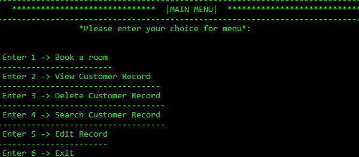

# Hotel Management System (C)

A simple, file-based hotel management system written in C. It helps manage rooms, guests, and bookings from a terminal interface.

## Features
- Book a room
- View Customer Record
- Delete Customer Record
- Search Customer Record
- Edit Record
- Cross-platform: Linux, macOS, Windows (MinGW)
